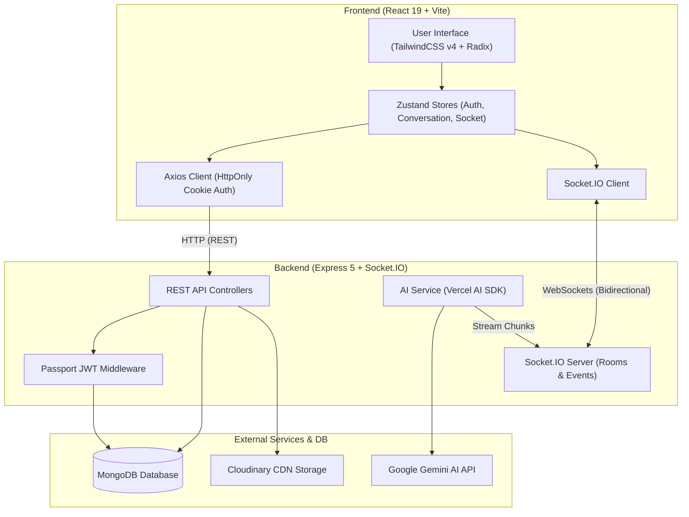

<div align="center">

# 💬 Realtime Chat App

**A production-ready, full-stack real-time messaging platform powered by React 19, Express 5, Socket.IO, and Google Gemini AI.**

[](https://realtime-chatapp-vn.onrender.com/conversation)
[](https://www.typescriptlang.org/)
[](https://react.dev/)
[](https://expressjs.com/)
[](https://socket.io/)
[](https://tailwindcss.com/)
[](LICENSE)

[🌐 **Explore Live Demo**](https://realtime-chatapp-vn.onrender.com/conversation) · [🐛 Report Bug](https://github.com/DucCuong159/Realtime-chatapp/issues) · [💡 Request Feature](https://github.com/DucCuong159/Realtime-chatapp/issues)

</div>

---

## 📖 Table of Contents

- [Overview](#-overview)
- [Key Features](#-key-features)
- [Architecture & Tech Stack](#-architecture--tech-stack)
- [System Architecture](#-system-architecture)
- [Project Structure](#-project-structure)
- [Getting Started](#-getting-started)
  - [Prerequisites](#prerequisites)
  - [Environment Configuration](#environment-configuration)
  - [Local Installation](#local-installation)
  - [Database Seeding](#database-seeding)
- [Deployment Guide (Render)](#-deployment-guide-render)
- [API Reference](#-api-reference)
- [Socket Events](#-socket-events)
- [Security & Performance](#-security--performance)
- [License](#-license)

---

## 🌟 Overview

**Realtime Chat App** is an end-to-end modern web application designed for seamless interpersonal communication and AI-assisted conversations. Inspired by modern messaging platforms like Messenger and Slack, it combines low-latency WebSocket communication with intelligent generative AI assistants, robust security, and an ultra-responsive interface.

---

## ✨ Key Features

### ⚡ Real-Time Messaging & Synchronization
- **Instant Messaging**: Low-latency bidirectional communication powered by **Socket.IO**.
- **Multi-Tab Synchronization**: Client socket tracking (`x-socket-id`) prevents duplicate notifications across multiple open tabs for the same user.
- **Online Presence Tracking**: Real-time user presence (online/offline indicator badges) dynamically tracked and broadcasted upon connection state changes.
- **Optimistic UI Updates**: Outgoing messages appear immediately with local temporary IDs and auto-reconcile with backend confirmations.

### 🤖 Gemini AI Assistant Integration
- **Streaming AI Responses**: Real-time token streaming with **Google Gemini (`gemini-2.5-flash`)** using the Vercel AI SDK.
- **Rich Markdown Formatting**: Streamed AI responses render with Markdown headings, syntax-highlighted code blocks, tables, and lists via **Streamdown**.
- **Sequential Conversation Queue**: Background message queuing ensures conversational coherence without race conditions during concurrent prompts.
- **Seedable AI Companion**: CLI seed script to initialize dedicated AI assistant profiles in MongoDB.

### 💬 Rich Conversation Experience
- **Direct & Group Conversations**: 1-on-1 direct chats with deterministic deduplication keys and multi-member group chats.
- **Message Replies & Context**: Quoting and replying to specific messages with quick navigation and highlight-scroll to referenced messages.
- **Media Sharing**: Image uploading and rendering with automatic Cloudinary storage and optimization.
- **Live Search & Filtering**: Instant search across users and conversation participants.

### 🔐 Security & Identity
- **JWT Authentication via HttpOnly Cookies**: Protection against XSS and token-theft attacks.
- **Passport.js JWT Strategy**: Robust request authentication middleware.
- **Password Hashing**: Bcrypt with salted rounds.
- **Strict Rate Limiting**: Anti-brute-force protection on authentication and message routes.
- **Security Headers**: Configured with **Helmet** and strict CORS policies.
- **Input Validation**: Strict schema validation using **Zod** across frontend and backend boundaries.

### 🎨 Modern UI / UX Design
- **Tailwind CSS v4**: Utility-first styling with modern CSS variables.
- **Light / Dark Mode**: Theme switching with persistent preferences.
- **Accessible Components**: Powered by **Radix / Base UI** primitives with keyboard navigation and ARIA attributes.
- **Responsive Layout**: Desktop aside navigation and mobile-first drawer views.

---

## 🛠 Architecture & Tech Stack

| Layer | Technology | Description |
| :--- | :--- | :--- |
| **Frontend Framework** | **React 19**, **TypeScript** | High-performance SPA with modern React hooks & concurrent features |
| **Build Tool** | **Vite 8** | Ultra-fast HMR and optimized production bundling |
| **State Management** | **Zustand 5** | Lightweight, reactive client stores for Auth, Conversation, and Socket |
| **Styling & Icons** | **TailwindCSS v4**, **Lucide**, **Remix Icons** | Modern design system with CSS custom properties |
| **Markdown / AI Rendering** | **Streamdown**, **harden-react-markdown** | Secure, XSS-hardened real-time Markdown stream viewer |
| **Backend Framework** | **Node.js 20+**, **Express 5** | Scalable asynchronous REST API & Static File Server |
| **Realtime Engine** | **Socket.IO 4** | WebSocket server with room management and authentication middleware |
| **AI SDK** | **Vercel AI SDK (`@ai-sdk/google`)** | Gemini model streaming API integration |
| **Database & ODM** | **MongoDB**, **Mongoose 9** | NoSQL document database with indexing and schema validation |
| **Cloud Storage** | **Cloudinary SDK** | Image transformation, upload, and CDN hosting |
| **Authentication** | **Passport.js**, **JWT**, **Bcrypt** | Stateless token authentication via HttpOnly cookies |
| **CI / CD** | **GitHub Actions**, **CodeRabbit** | Automated CI pipeline with AI code review integration |
| **Cloud Hosting** | **Render.com** | Fullstack monorepo deployment on containerized cloud |

---

## 🏗 System Architecture



---

## 📁 Project Structure

```text
realtime-chatapp/
├── backend/                  # Express 5 Backend API & Socket Server
│   ├── src/
│   │   ├── config/           # Environment variables, DB, Cloudinary & Passport config
│   │   ├── controllers/      # Route request handlers (auth, user, conversation)
│   │   ├── lib/              # Socket.IO initialization & event emitters
│   │   ├── middleware/       # JWT auth, error handlers, rate limiters
│   │   ├── models/           # Mongoose schemas (User, Conversation, Message)
│   │   ├── routes/           # Express REST route definitions
│   │   ├── script/           # Seed scripts (Gemini AI profile seeder)
│   │   ├── services/         # Business logic (Message, AI streaming, Auth)
│   │   ├── utils/            # JWT, Cookie, and helper utilities
│   │   └── index.ts          # Server entry point & static SPA serving
│   ├── package.json
│   └── tsconfig.json
│
├── frontend/                 # React 19 SPA (Vite + TailwindCSS v4)
│   ├── src/
│   │   ├── assets/           # Static icons and branding logos
│   │   ├── components/       # Reusable UI components & layouts
│   │   │   ├── auth/         # Login & Register forms
│   │   │   ├── conversation/ # Header, Message List, Footer, ReplyBar, Popovers
│   │   │   └── ui/           # Buttons, Inputs, Avatars, Modals, Markdown Response
│   │   ├── hooks/            # Zustand stores (useAuth, useConversation, useSocket)
│   │   ├── lib/              # Axios client instance, date formatting & utils
│   │   ├── pages/            # Application routes (Chat, Auth, 404)
│   │   ├── routes/           # React Router route definitions & protected route guards
│   │   ├── types/            # TypeScript data contracts & payload models
│   │   ├── App.tsx           # Root component with Theme & Toast providers
│   │   └── main.tsx          # React application entry point
│   ├── package.json
│   ├── vite.config.ts
│   └── tsconfig.json
│
├── .github/                  # GitHub Actions CI workflows & issue templates
├── .coderabbit.yaml          # CodeRabbit AI code review configuration
└── README.md
```

---

## 🚀 Getting Started

### Prerequisites

- **Node.js**: `v20.x` or `v22.x` / `v24.x`
- **Yarn**: `v1.22.x`
- **MongoDB**: Local MongoDB instance or [MongoDB Atlas URI](https://www.mongodb.com/atlas)
- **Cloudinary Account**: Cloud name, API Key, and Secret from [Cloudinary Console](https://cloudinary.com)
- **Google Gemini API Key**: API key from [Google AI Studio](https://aistudio.google.com/)

---

### Environment Configuration

#### 1. Backend Environment (`backend/.env`)

Create a `.env` file in the `backend/` directory:

```env
# Application
NODE_ENV=development
PORT=8080
FRONTEND_ORIGIN=http://localhost:5173

# Database
MONGO_URI=mongodb+srv://<username>:<password>@cluster.mongodb.net/realtime-chat?retryWrites=true&w=majority

# JWT Authentication
JWT_SECRET=your_super_secret_jwt_key_at_least_32_characters_long
JWT_EXPIRES_IN=7d

# Cloudinary (Media Uploads)
CLOUDINARY_CLOUD_NAME=your_cloudinary_cloud_name
CLOUDINARY_API_KEY=your_cloudinary_api_key
CLOUDINARY_API_SECRET=your_cloudinary_api_secret

# Google Gemini AI
GOOGLE_GENERATIVE_AI_API_KEY=your_gemini_api_key
```

#### 2. Frontend Environment (`frontend/.env`)

Create a `.env` file in the `frontend/` directory (optional in development, defaults to `http://localhost:8080`):

```env
VITE_API_URL=http://localhost:8080
```

---

### Local Installation

1. **Clone the repository:**
   ```bash
   git clone https://github.com/DucCuong159/Realtime-chatapp.git
   cd Realtime-chatapp
   ```

2. **Install dependencies:**
   ```bash
   # Install frontend dependencies
   yarn --cwd frontend install

   # Install backend dependencies
   yarn --cwd backend install
   ```

3. **Seed the Gemini AI Model:**
   ```bash
   yarn --cwd backend run seed:ai
   ```

4. **Start local development servers:**
   ```bash
   # In terminal 1: Start Backend (Port 8080)
   yarn --cwd backend dev

   # In terminal 2: Start Frontend (Port 5173)
   yarn --cwd frontend dev
   ```

5. Open your browser and navigate to `http://localhost:5173`.

---

## 🌐 Deployment Guide (Render)

This repository is optimized for zero-configuration monorepo deployment on **[Render.com](https://render.com/)** as a single Web Service:

1. Connect your GitHub repository to Render and create a **Web Service**.
2. Configure the following settings:

| Setting | Value |
| :--- | :--- |
| **Runtime** | `Node` |
| **Root Directory** | *(Leave blank)* |
| **Build Command** | `yarn --cwd frontend install --production=false && yarn --cwd frontend build && rm -rf frontend/node_modules && yarn --cwd backend install --production=false && yarn --cwd backend build` |
| **Start Command** | `yarn --cwd backend start` |
| **Plan** | `Free` (or higher) |

3. Under **Environment Variables**, add all keys from `backend/.env` (set `NODE_ENV=production`).
4. Click **Deploy Web Service**. Render will automatically build the React Vite bundle, compile TypeScript, and serve the application!

---

## 📡 API Reference

### Authentication (`/api/auth`)
| Method | Endpoint | Description | Auth Required |
| :--- | :--- | :--- | :---: |
| `POST` | `/api/auth/register` | Register a new user account | No |
| `POST` | `/api/auth/login` | Log in and receive HttpOnly session cookie | No |
| `POST` | `/api/auth/logout` | Invalidate session and clear auth cookie | Yes |
| `GET` | `/api/auth/status` | Verify current session and retrieve profile | Yes |

### Users (`/api/user`)
| Method | Endpoint | Description | Auth Required |
| :--- | :--- | :--- | :---: |
| `GET` | `/api/user/all` | Get list of available users for direct chats | Yes |

### Conversations & Messages (`/api/conversation`)
| Method | Endpoint | Description | Auth Required |
| :--- | :--- | :--- | :---: |
| `GET` | `/api/conversation/all` | List all user conversations with last message | Yes |
| `POST` | `/api/conversation/create` | Create direct (1-on-1) or group conversation | Yes |
| `GET` | `/api/conversation/:id` | Fetch conversation details and message history | Yes |
| `POST` | `/api/conversation/message/send` | Send text / image / reply message | Yes |

---

## 🔌 Socket Events

| Event Name | Direction | Payload | Purpose |
| :--- | :---: | :--- | :--- |
| `user:online` | Server ➔ Client | `{ userId: string }` | Broadcast user presence online |
| `user:offline` | Server ➔ Client | `{ userId: string }` | Broadcast user presence offline |
| `conversation:message` | Server ➔ Client | `MessageType` | Broadcast new message to conversation room |
| `conversation:lastMessage`| Server ➔ Client | `{ conversationId, lastMessage }` | Update conversation list preview |
| `conversation:ai` | Server ➔ Client | `{ conversationId, chunk, done, message, error }` | Real-time AI response streaming |

---

## 🛡 Security & Performance Highlights

- 🔒 **HttpOnly & Secure Cookies**: Protects access tokens from JavaScript execution contexts.
- 🛡 **Helmet Protection**: Adds secure HTTP response headers (`Content-Security-Policy`, `X-Content-Type-Options`).
- 🚦 **Rate Limiting**: Throttles brute-force attempts on sensitive endpoints.
- 📦 **Optimized Asset Chunking**: Split CSS and dynamic chunks for lightning-fast First Contentful Paint (FCP).
- 🧹 **Zero-Leak Memory Management**: Automatic cleanup of socket listeners and timeout subscriptions on component unmount.

---

## 📄 License

This project is licensed under the [ISC License](LICENSE).

---

<div align="center">
  <sub>Developed with ❤️ by <a href="https://github.com/DucCuong159">DucCuong159</a></sub>
</div>
