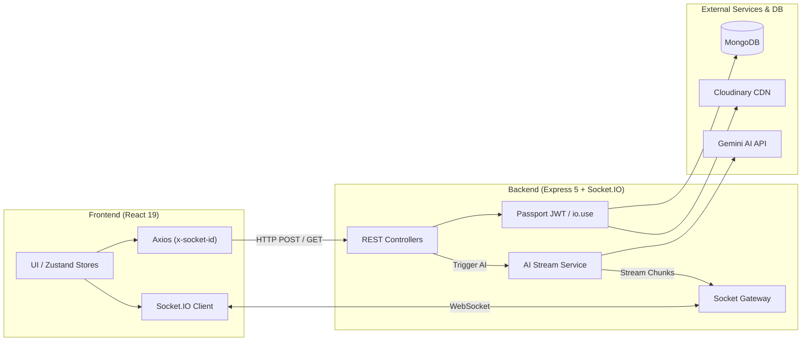

<div align="center">

# 💬 Realtime Chat App

**A production-ready full-stack real-time messaging platform powered by React 19, Express 5, Socket.IO 4, and Google Gemini AI.**

[](https://realtime-chatapp-vn.onrender.com/conversation)
[](https://www.typescriptlang.org/)
[](https://react.dev/)
[](https://expressjs.com/)
[](https://socket.io/)
[](https://tailwindcss.com/)
[](https://mongoosejs.com/)
[](https://sdk.vercel.ai/)
[](LICENSE)

[🌐 **Live Demo**](https://realtime-chatapp-vn.onrender.com/conversation) · [🐛 **Report Bug**](https://github.com/DucCuong159/Realtime-chatapp/issues) · [💡 **Request Feature**](https://github.com/DucCuong159/Realtime-chatapp/issues)

</div>

---

## 🌟 Overview

**Realtime Chat App** delivers low-latency interpersonal chat and AI assistant workflows. It combines a **Hybrid HTTP REST + WebSocket architecture**, **Dynamic Google Gemini AI model switching**, and **cursor-based pagination** with zero-drift scroll restoration.

---

## ✨ Key Features

- ⚡ **Hybrid Real-Time Pipeline**: HTTP POST for data validation & media uploads; Socket.IO for real-time room broadcasting.
- 🔄 **Multi-Tab Sync & Echo Prevention**: Request header `x-socket-id` and `.except(socketId)` prevent duplicate messages on the sender's active tab while syncing all other tabs.
- 🟢 **Accurate Online Presence**: Multi-tab tracking via `Map<userId, Set<socketId>>` — users only show offline when all sessions disconnect.
- 🎯 **Optimistic UI & Auto-Rollback**: Instant UI feedback with local UUIDs, server ID reconciliation, and fail-safe sidebar rollback on error.
- 🤖 **Gemini AI Streaming & Dynamic Selector**: Real-time token streaming, live quota latency check (`checkModelQuota`), auto-fallback on 429 quota limits, and markdown rendering with XSS hardening.
- 📜 **Cursor-Based Pagination & Infinite Scroll**: Keyset pagination with MongoDB Compound Index `{ conversationId: 1, createdAt: -1 }` ($O(\log N)$) and `useLayoutEffect` Element-Anchor scroll restoration (Zero Viewport Drift).
- 💬 **Rich Messaging**: 1-on-1 and group chats, message replies with context quotes, Cloudinary media sharing (up to 15MB), and user search.
- 📞📹 **Real-Time WebRTC Voice & Video Calling (1-on-1)**: Peer-to-peer ultra-low latency audio & video calls (up to 1080p), camera flip/toggle, remote video visibility synchronization, local PiP preview, responsive full-screen active modal, floating minimized pill widget, Web Audio API sound synthesis, and automatic chat history call logging with duration.
- 🔐 **Hardened Security**: Stateless JWT in `HttpOnly` `SameSite` cookies, Passport authentication, bcrypt hashing, rate limiting, and Zod validation.

---

## 🛠 Tech Stack

| Layer | Technologies |
| :--- | :--- |
| **Frontend** | React 19, TypeScript, Vite 8, Zustand 5, Tailwind CSS v4, Base UI, Streamdown |
| **Backend** | Node.js 20+, Express 5, Socket.IO 4, Mongoose 9 (MongoDB), Passport.js, Zod 4 |
| **AI & Media** | Vercel AI SDK (`ai` v7, `@ai-sdk/google` v4), Google Gemini Models, Cloudinary SDK |
| **Dev & Infra** | Render.com (Monorepo Web Service), GitHub Actions, CodeRabbit |

---

## 🏗 Architecture Overview



---

## 📁 Project Structure

```text
realtime-chatapp/
├── backend/                       # Express 5 & Socket.IO Gateway
│   ├── src/
│   │   ├── config/                # DB, Cloudinary, Passport, Env configs
│   │   ├── controllers/           # ai, auth, conversation, message, user controllers
│   │   ├── lib/socket.ts          # Socket Gateway, auth handshake, room emitters
│   │   ├── models/                # Conversation, Message, User Mongoose schemas
│   │   ├── routes/                # ai, auth, conversation, user routes
│   │   ├── script/                # seedGeminiAI.ts, listGeminiModels.ts, spamMessages.ts
│   │   ├── services/              # AI queue, auth, conversation keyset queries, messages
│   │   ├── utils/ & validators/   # Zod schemas, JWT cookies, media utils
│   │   └── index.ts               # Server entry point & static SPA server
├── frontend/                      # React 19 SPA (Vite + Tailwind CSS v4)
│   ├── src/
│   │   ├── components/            # UI primitives, conversation detail, AI model selector
│   │   ├── hooks/                 # Zustand stores (useAuth, useConversation, useSocket, useAiModels)
│   │   ├── lib/                   # Axios client with x-socket-id interceptor
│   │   ├── pages/                 # Auth & Conversation views
│   │   ├── types/                 # TypeScript data contracts
│   │   └── App.tsx & main.tsx     # App root & entry point
└── README.md
```

---

## 🚀 Getting Started

### 1. Prerequisites
- **Node.js**: `v20.x` or newer & **Yarn**: `v1.22.x`
- **MongoDB**: Local or Atlas connection URI
- **Cloudinary** & **Google Gemini AI** API keys

### 2. Environment Variables

**Backend (`backend/.env`):**
```env
PORT=8080
NODE_ENV=development
FRONTEND_ORIGIN=http://localhost:5173
MONGO_URI=mongodb+srv://<user>:<password>@cluster.mongodb.net/chat?retryWrites=true&w=majority
JWT_SECRET=your_super_secret_jwt_key_min_32_chars
JWT_EXPIRES_IN=7d
CLOUDINARY_CLOUD_NAME=your_cloud_name
CLOUDINARY_API_KEY=your_api_key
CLOUDINARY_API_SECRET=your_api_secret
GOOGLE_GENERATIVE_AI_API_KEY=your_gemini_api_key
```

**Frontend (`frontend/.env`):**
```env
VITE_API_URL=http://localhost:8080
```

### 3. Installation & Run

```bash
# Clone repository
git clone https://github.com/DucCuong159/Realtime-chatapp.git
cd Realtime-chatapp

# Install dependencies
yarn install              # Root: activates Husky git hooks & commitlint
yarn --cwd frontend install
yarn --cwd backend install

# Seed Gemini AI user companion
yarn --cwd backend seed:ai

# Start development servers
yarn --cwd backend dev    # Terminal 1: Port 8080
yarn --cwd frontend dev   # Terminal 2: Port 5173
```

---

## 📡 API & Socket.IO Reference

### REST Endpoints

| Group | Method | Endpoint | Description | Auth |
| :--- | :---: | :--- | :--- | :---: |
| **Auth** | `POST` | `/api/auth/register` | Register user (5 req/hr limit) | No |
| | `POST` | `/api/auth/login` | Login & set HttpOnly cookie (5 req/15m limit) | No |
| | `POST` | `/api/auth/logout` | Clear auth session cookie | Yes |
| | `GET` | `/api/auth/status` | Verify JWT and return profile | Yes |
| **User** | `GET` | `/api/user/all` | Get registered users list | Yes |
| **Chat** | `GET` | `/api/conversation/all` | Fetch user conversations with last message | Yes |
| | `POST` | `/api/conversation/create` | Create 1-on-1 or group conversation | Yes |
| | `GET` | `/api/conversation/:id` | Get messages with cursor pagination (`?cursor=&limit=30`) | Yes |
| | `POST` | `/api/conversation/message/send` | Send message / prompt AI (`x-socket-id` header) | Yes |
| **AI** | `GET` | `/api/ai/models` | Get active Gemini models & quota latency (`?refresh=true`) | Yes |

### Socket.IO Events

| Event Name | Direction | Payload | Description |
| :--- | :---: | :--- | :--- |
| `online:users` | Server ➔ All | `string[]` | Broadcast online user IDs |
| `conversation:join` | Client ➔ Server | `conversationId, callback` | Join room `conversation:<id>` |
| `conversation:leave`| Client ➔ Server | `conversationId` | Leave room `conversation:<id>` |
| `message:new` | Server ➔ Room | `MessageType` | New message in room (excludes sender tab) |
| `conversation:updated` | Server ➔ User | `{ conversationId, lastMessage }` | Update sidebar preview and bump rank |
| `conversation:new` | Server ➔ User | `ConversationType` | Notify user of new conversation |
| `conversation:ai` | Server ➔ Room | `{ chunk, done, message, error }` | Stream AI tokens and completion |
| `call:initiate` | Caller ➔ Server | `{ callId, calleeId, conversationId?, callType? }` | Request starting a 1-on-1 voice or video call |
| `call:incoming` | Server ➔ Callee | `{ callId, conversationId?, caller, callType? }` | Trigger incoming call ring & modal |
| `call:accept` | Callee ➔ Server | `{ callId }` | Callee accepts call, transitions to connecting |
| `call:accepted` | Server ➔ Caller | `{ callId, calleeId }` | Notify caller to initiate WebRTC SDP Offer |
| `call:connected`| Client ➔ Server | `{ callId }` | Notify P2P media is connected, starts duration accounting |
| `call:toggle-video` | Bidirectional | `{ callId, isVideoOff }` | Sync camera on/off state between peers |
| `call:reject` / `call:rejected` | Bidirectional | `{ callId, reason }` | Decline/busy/timeout call & log to DB |
| `call:end` / `call:ended` | Bidirectional | `{ callId, reason }` | End active call, teardown & log to DB |
| `webrtc:offer` / `answer` | Client ➔ Client | `{ callId, sdp }` | Exchange SDP session descriptions |
| `webrtc:ice-candidate` | Client ➔ Client | `{ callId, candidate }` | Exchange P2P network candidates |

---

## 🌐 Deployment (Render)

Optimized for monorepo single-service deployment on **Render.com**:
- **Build Command**: `yarn --cwd frontend install --production=false && yarn --cwd frontend build && rm -rf frontend/node_modules && yarn --cwd backend install --production=false && yarn --cwd backend build`
- **Start Command**: `yarn --cwd backend start`
- **Environment Variables**: Add all keys from `backend/.env` with `NODE_ENV=production`.

---

## 📄 License

Licensed under the [ISC License](LICENSE).

<div align="center">
  <sub>Developed with ❤️ by <a href="https://github.com/DucCuong159">DucCuong159</a></sub>
</div>

